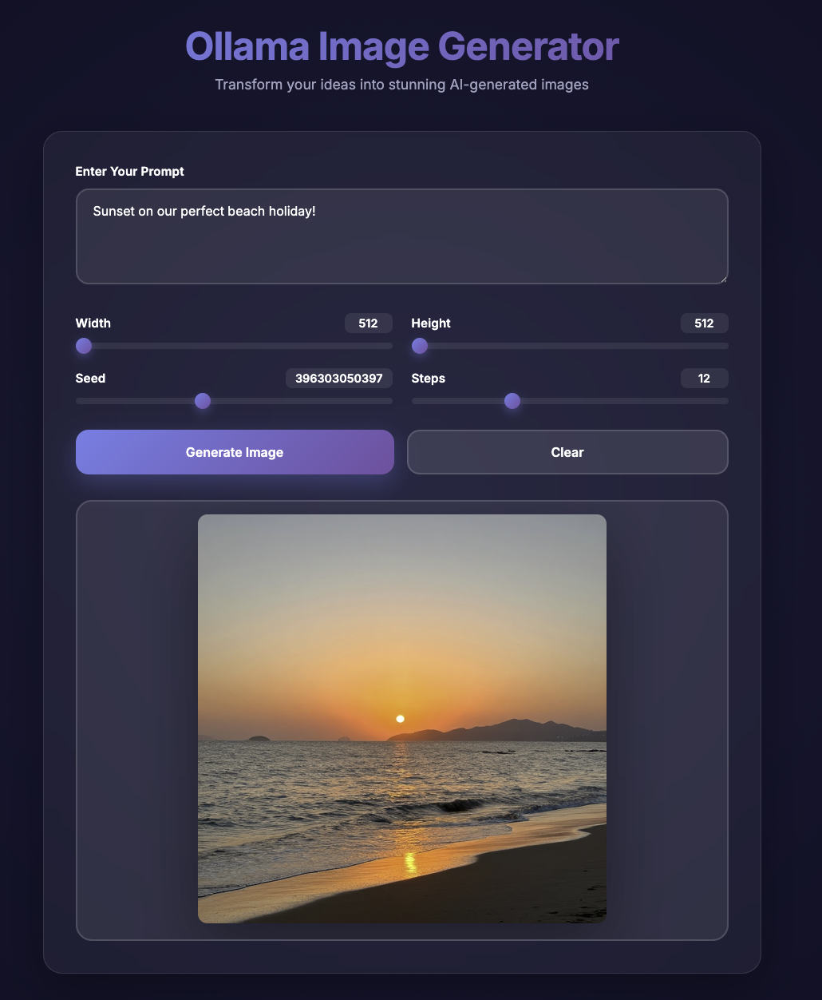

# Ollama Image Generator

## Overview
This project is a simple proxy server for the Ollama Image Generator, which serves an HTML interface and forwards API requests to the Ollama API. The purpose of this is to overcome the CORS policy of many browserswhich prevents direct access to the Ollama API from a local HTML file. The main components include:
- **`server.py`**: The backend server that handles API requests and serves the HTML interface.
- **`index.html`**: The frontend interface for users to interact with the image generation functionality.

## Architecture
- The server listens on port **8080** and forwards requests to the Ollama API located at **`http://localhost:11434/api/generate`**.
- The server acts as a proxy, forwarding requests from the HTML interface to the Ollama API and returning the generated images to the HTML interface in 'stream' format so that the progress of the image generation is displayed as it is being generated.
- The HTML interface is served directly from the server, allowing users to generate images through a web interface.
- Tested to work with Python 3.9 and later

## To set up and start the server
- Clone the repository.
- From the terminal run: <pre>ollama pull x/z-image-turbo:bf16</pre>
- Run `python3 server.py` in the terminal.
- Open `http://localhost:8080` in your web browser.

## Key Files
- **`server.py`**: Main server logic and API handling.
- **`index.html`**: User interface for image generation.

## Author
- Nick Lansley
- [GitHub](https://github.com/nicklansley)

